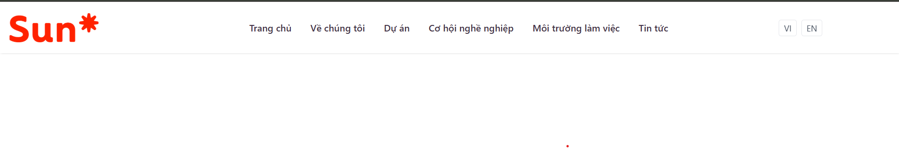
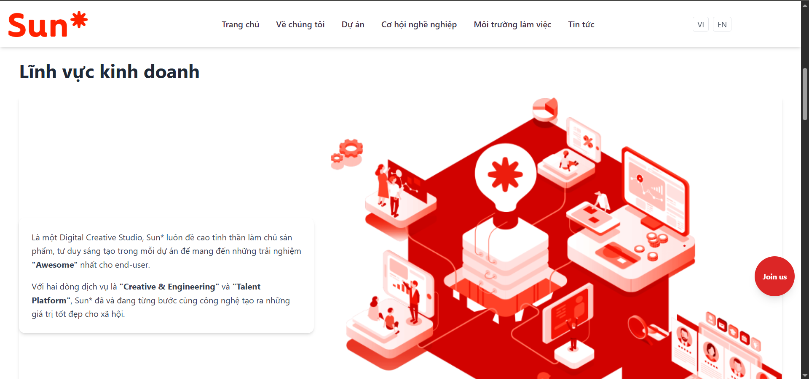
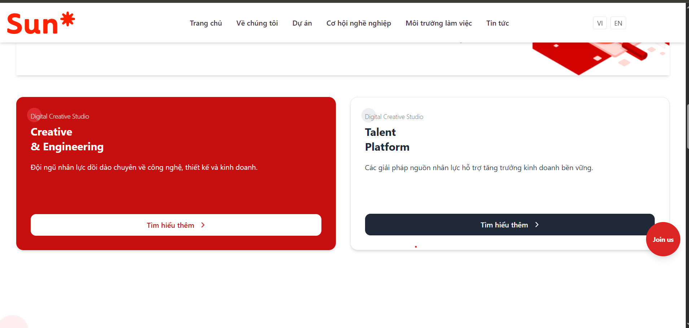
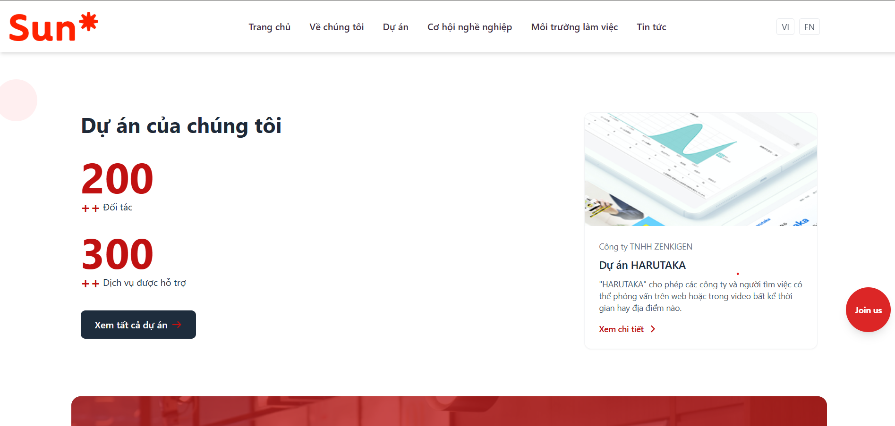
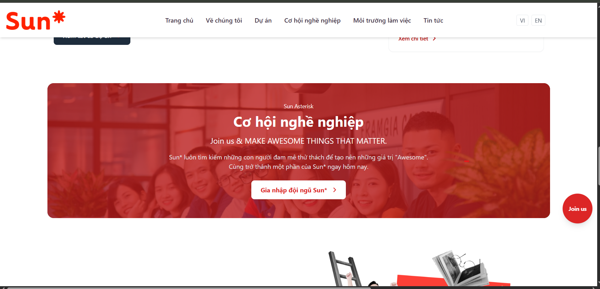
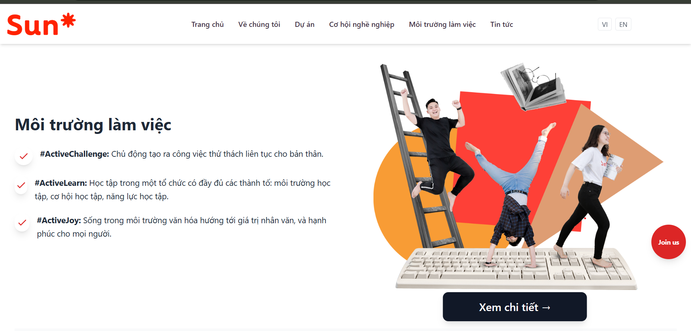
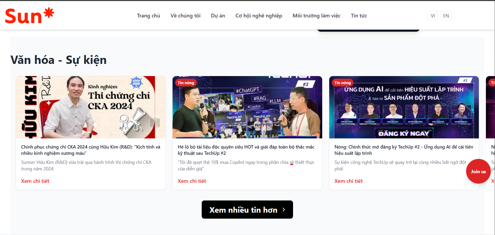
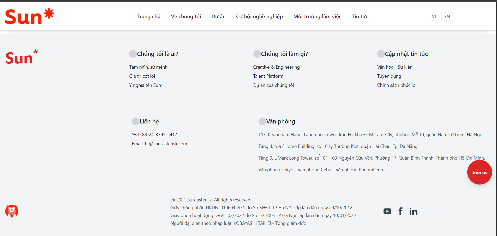

# Frontend-Intern
Content: design frontend like Sun Asterisk Homepage

Technology: html, css, tailwindcss

Build frontend command: Run 2 terminal at the same time

One terminal to build css: `npm run build:css`
The other terminal to live server: `npm run start:dev`
! The parts: `build:css` and `start:dev` can be fixed in package.json file.

# DEMO
1. Menu

2. Business Field

3. Banner

4. Our Products

5. Bussiness Chances

6. Business Environment

7. Cultures - Events

8. Footer 

# VIDEO
GG Drive: [Frontend Demo](https://drive.google.com/file/d/1U4nTs5eDE77jwewTk5TTRyi7YK33Pc46/view?usp=sharing)